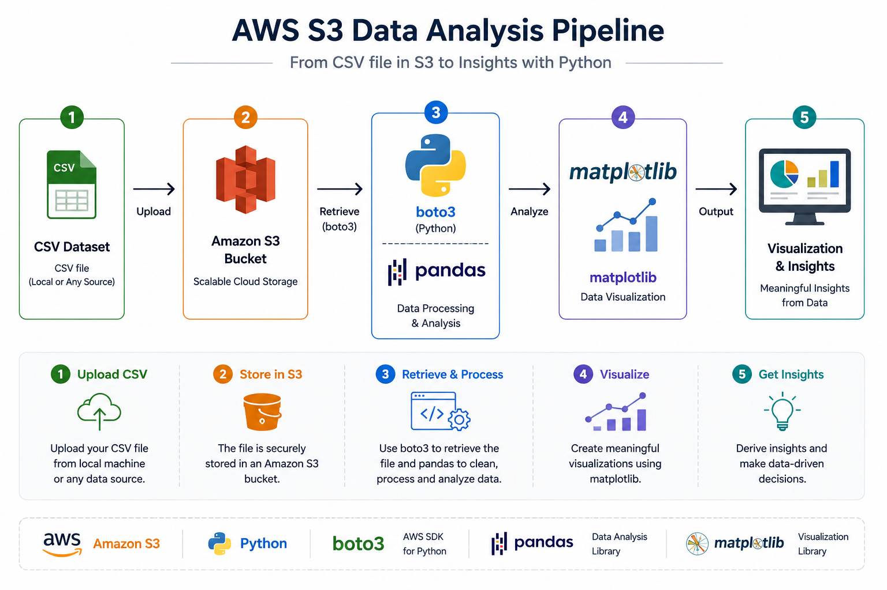
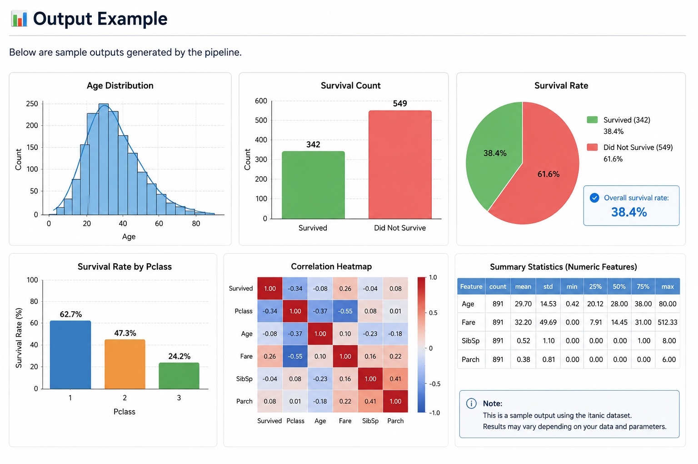

## ⭐ Key Features

- Cloud-based data storage using AWS S3
- Data retrieval with boto3
- Data analysis using pandas
- Visualization using matplotlib

---
  
# AWS S3 Data Analysis


---

## 📖 Overview

This project demonstrates how to build a simple cloud-based data analysis pipeline using **AWS S3** and **Python**.

CSV files stored in Amazon S3 are retrieved with **boto3**, analyzed using **pandas**, and visualized with **matplotlib**.

---

## 🏗 Workflow

<p align="center">
  
</p>

---

## 🛠 Tech Stack

| Category | Technologies |
|----------|--------------|
| Language | Python |
| Cloud | AWS S3 |
| Library | boto3, pandas, matplotlib |
| Version Control | Git / GitHub |

---

## 📂 Project Structure

```text
aws-s3-analysis/
│
├── data/
│   └── sample.csv
│
├── images/
│   └── workflow.png
│
├── src/
│   ├── s3_analysis.py
│   └── s3_graph.py
│
├── requirements.txt
├── .gitignore
└── README.md
```

---

## 🚀 Workflow

1. Upload a CSV file to Amazon S3
2. Retrieve the file using boto3
3. Load the data into pandas
4. Perform exploratory data analysis
5. Visualize the results using matplotlib

---

## ▶️ How to Run

```bash
git clone https://github.com/shibata-bio/aws-s3-analysis.git

cd aws-s3-analysis

pip install -r requirements.txt

python src/s3_analysis.py
python src/s3_graph.py
```

---


<p align="center">
  
</p>

---

## 📖 What I Learned

- Building a cloud-based data analysis workflow
- Managing datasets with Amazon S3
- Accessing AWS services using boto3
- Processing tabular data with pandas
- Visualizing analytical results with matplotlib
- Organizing a Python project using Git and GitHub

---

## 🔮 Future Improvements

- Automate the workflow using AWS Lambda
- Deploy the application with Docker
- Build an interactive dashboard using Streamlit
- Integrate Amazon Athena for SQL-based analysis

---

## 📄 License

This project is licensed under the MIT License.
